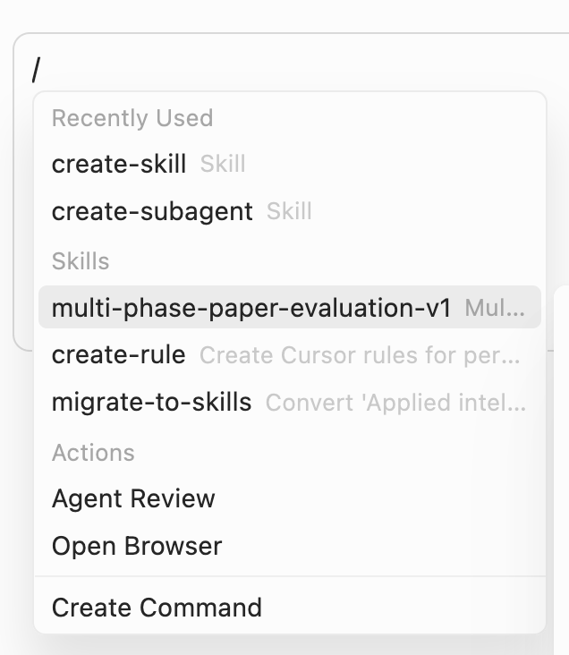

# Skills

Best practices for academic writing skills.

## Get Started (Cursor)

1. Clone the repository to your project root folder

```bash
git clone https://github.com/Xtra-Computing/skills.git .cursor/skills/xtra-computing
```

2. **Done.** You can use cursor to evaluate the skills by typing `/`

3. **Note:** Please use high-capability large language models (e.g., `Claude Sonnet`, `Claude Opus`, `Kimi K2.5`, etc.).


